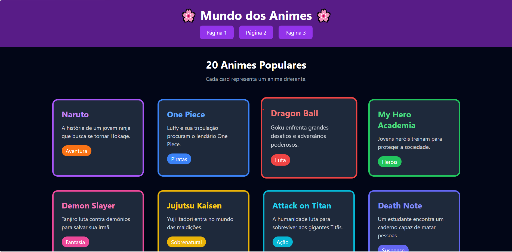
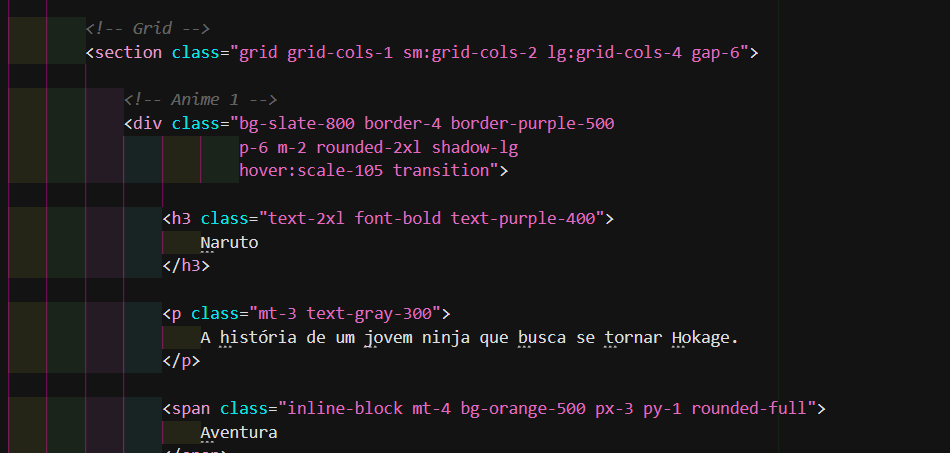
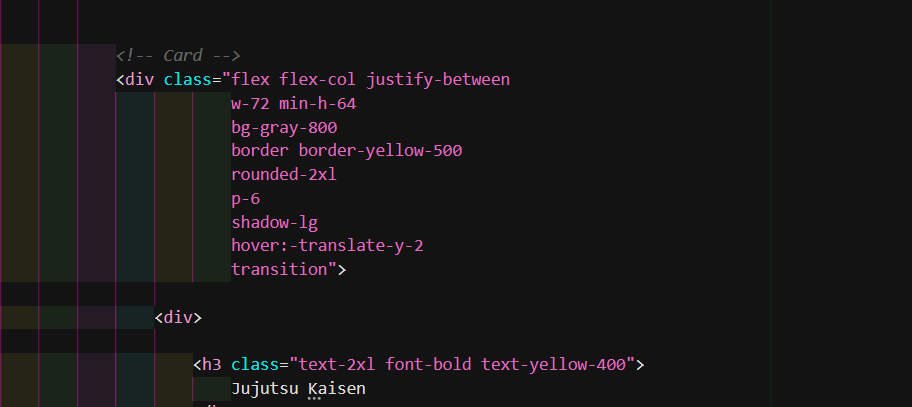

# 🎌 Atividade — Tailwind CSS

## 📚 Sobre o projeto

Este projeto foi desenvolvido como uma atividade prática para aprender e aplicar o **Tailwind CSS** na criação de páginas web.

A proposta foi desenvolver um sistema com o tema de **animes**, utilizando diferentes elementos para representar cada anime. Durante o desenvolvimento, foram trabalhados conceitos de **Box Model, Flexbox e Responsividade**, utilizando as classes utilitárias disponibilizadas pelo Tailwind CSS.

O projeto possui três páginas, cada uma com uma finalidade diferente, permitindo colocar em prática os principais recursos do framework.

---

# 🎨 Por que utilizar o Tailwind CSS?

O **Tailwind CSS** facilita o desenvolvimento de interfaces porque permite estilizar os elementos diretamente no HTML por meio de classes utilitárias.

Em um projeto utilizando CSS tradicional, normalmente é necessário criar um arquivo `.css`, criar classes e depois relacioná-las aos elementos HTML.

Com o Tailwind, grande parte desse processo pode ser feita diretamente no elemento:

```html
<div class="bg-purple-600 text-white p-6 rounded-2xl shadow-lg">
    Demon Slayer
</div>
```

Nesse exemplo, as próprias classes definem:

* `bg-purple-600` → cor de fundo
* `text-white` → cor do texto
* `p-6` → espaçamento interno
* `rounded-2xl` → bordas arredondadas
* `shadow-lg` → sombra

Isso torna o desenvolvimento mais rápido e facilita a visualização dos estilos que estão sendo aplicados em cada elemento.

### ⚡ Desenvolvimento mais rápido

O Tailwind disponibiliza diversas classes prontas para trabalhar com:

* Cores
* Tamanhos
* Margens
* Espaçamentos
* Bordas
* Sombras
* Flexbox
* Grid
* Responsividade
* Tipografia

Assim, não é necessário criar manualmente uma regra CSS para cada elemento.

### 📄 Menos CSS escrito manualmente

Uma das principais vantagens é a redução da necessidade de criar diversas regras CSS personalizadas.

Em vez de:

```css
.card {
    background-color: purple;
    color: white;
    padding: 24px;
    border-radius: 16px;
}
```

Podemos utilizar:

```html
<div class="bg-purple-600 text-white p-6 rounded-2xl">
```

Isso deixa o desenvolvimento mais direto e facilita a manutenção dos estilos.

### 📱 Responsividade simplificada

O Tailwind também facilita a criação de páginas responsivas.

Por exemplo:

```html
<div class="grid grid-cols-1 sm:grid-cols-2 md:grid-cols-3 lg:grid-cols-4">
```

Nesse caso, a quantidade de colunas muda de acordo com o tamanho da tela.

---

# 🔄 Tailwind CSS x CSS tradicional

| CSS tradicional                               | Tailwind CSS                          |
| --------------------------------------------- | ------------------------------------- |
| Necessita criar regras CSS                    | Utiliza classes utilitárias           |
| Normalmente utiliza arquivos CSS separados    | Pode concentrar a estilização no HTML |
| É necessário criar nomes para classes         | Classes já possuem funções definidas  |
| Responsividade exige criação de media queries | Possui classes responsivas prontas    |
| Pode exigir mais troca entre HTML e CSS       | Estilos ficam próximos do elemento    |

---

# 🎯 Objetivos da atividade

O objetivo da atividade foi praticar os principais conceitos de estilização utilizando Tailwind CSS.

Durante o desenvolvimento foram trabalhados:

* Utilização de classes utilitárias;
* Box Model;
* Flexbox;
* Grid;
* Responsividade;
* Cores;
* Tipografia;
* Margens e espaçamentos;
* Bordas;
* Sombras;
* Efeitos de `hover`;
* Organização de elementos;
* Criação de páginas responsivas.

---

# 🛠️ Tecnologias utilizadas

* HTML5
* Tailwind CSS
* JavaScript
* Visual Studio Code
* Git e GitHub

O Tailwind CSS foi utilizado através do CDN:

```html
<script src="https://cdn.tailwindcss.com"></script>
```

---

# 📂 Estrutura do projeto

O projeto está organizado da seguinte forma:

```text
atividade-animes/
│
├── index.html
├── pagina2.html
├── pagina3.html
└── README.md
```

---

# 🖥️ Páginas desenvolvidas

## 📄 Página 1 — Box Model

A primeira página foi desenvolvida para trabalhar conceitos relacionados ao **Box Model**.

Foram utilizados elementos com:

* Margens;
* Espaçamentos internos;
* Bordas;
* Largura;
* Altura;
* Bordas arredondadas;
* Sombras.

Cada card representa um anime diferente.

---

## 📄 Página 2 — Flexbox

A segunda página utiliza recursos do **Flexbox** para organizar os elementos.

Foram utilizadas classes como:

```text
flex
flex-wrap
justify-center
items-stretch
flex-col
justify-between
gap-6
```

Essas classes permitem organizar os cards de maneira flexível e adaptável.

---

## 📄 Página 3 — Responsividade

A terceira página foi desenvolvida com foco em **responsividade**.

Foram utilizadas classes que alteram a quantidade de colunas de acordo com o tamanho da tela:

```html
grid-cols-1
sm:grid-cols-2
md:grid-cols-3
lg:grid-cols-4
```

Dessa forma, os elementos conseguem se adaptar a computadores, tablets e celulares.

---

# 🎨 Classes Tailwind utilizadas

Durante a atividade foram utilizadas diversas classes do Tailwind CSS.

| Classe                | Função                                     |
| --------------------- | ------------------------------------------ |
| `bg-slate-950`        | Define a cor de fundo                      |
| `bg-slate-800`        | Define uma cor de fundo secundária         |
| `bg-purple-900`       | Define fundo roxo escuro                   |
| `bg-purple-600`       | Define fundo roxo                          |
| `text-white`          | Define texto branco                        |
| `text-gray-300`       | Define texto cinza claro                   |
| `text-gray-400`       | Define texto cinza                         |
| `text-4xl`            | Define tamanho grande para texto           |
| `text-3xl`            | Define tamanho do texto                    |
| `text-2xl`            | Define tamanho do texto                    |
| `font-bold`           | Define texto em negrito                    |
| `text-center`         | Centraliza o texto                         |
| `p-6`                 | Define espaçamento interno                 |
| `p-8`                 | Define espaçamento interno                 |
| `m-2`                 | Define margem                              |
| `mt-3`                | Define margem superior                     |
| `mt-4`                | Define margem superior                     |
| `mt-6`                | Define margem superior                     |
| `mb-3`                | Define margem inferior                     |
| `mb-10`               | Define margem inferior                     |
| `mx-auto`             | Centraliza horizontalmente                 |
| `max-w-7xl`           | Define largura máxima                      |
| `max-w-6xl`           | Define largura máxima                      |
| `grid`                | Ativa o CSS Grid                           |
| `grid-cols-1`         | Define uma coluna                          |
| `sm:grid-cols-2`      | Define duas colunas em telas maiores       |
| `md:grid-cols-3`      | Define três colunas                        |
| `lg:grid-cols-4`      | Define quatro colunas                      |
| `gap-6`               | Define espaçamento entre elementos         |
| `flex`                | Ativa o Flexbox                            |
| `flex-wrap`           | Permite quebra dos elementos               |
| `justify-center`      | Centraliza os elementos                    |
| `items-stretch`       | Ajusta os itens no eixo transversal        |
| `flex-col`            | Organiza elementos em coluna               |
| `justify-between`     | Distribui os elementos                     |
| `rounded-2xl`         | Arredonda as bordas                        |
| `border`              | Adiciona uma borda                         |
| `border-4`            | Define espessura da borda                  |
| `shadow-lg`           | Adiciona sombra                            |
| `hover:scale-105`     | Aumenta o elemento ao passar o mouse       |
| `hover:bg-purple-500` | Altera o fundo no hover                    |
| `transition`          | Adiciona transição aos efeitos             |
| `w-72`                | Define largura                             |
| `min-h-64`            | Define altura mínima                       |
| `overflow-hidden`     | Esconde conteúdo que ultrapassa o elemento |
| `h-32`                | Define altura                              |
| `inline-block`        | Define comportamento inline-block          |

---

# 📸 Prints do projeto

Nesta seção estão os registros do desenvolvimento e do resultado final da atividade.

## 🖥️ Print da aplicação funcionando

A imagem abaixo mostra o resultado final do sistema desenvolvido com Tailwind CSS e o tema de animes.


---

## 💻 Print do código — Página 1

A imagem abaixo apresenta como ficou o design do projeto desenvolvido.



---

## 💻 Print do código — Página 2

As imagens abaixo apresenta parte do código utilizado no desenvolvimento da segunda página do projeto.





---

# 📱 Responsividade

O projeto também foi desenvolvido pensando em diferentes tamanhos de tela.

As classes responsivas do Tailwind permitem alterar o layout de acordo com a largura disponível.

Exemplo utilizado:

```html
grid-cols-1 sm:grid-cols-2 md:grid-cols-3 lg:grid-cols-4
```

Assim:

* 📱 **Celular:** 1 coluna
* 📱 **Tela maior/tablet:** 2 colunas
* 💻 **Desktop médio:** 3 colunas
* 🖥️ **Desktop grande:** 4 colunas

---


# 👩‍💻 Desenvolvedora

**Tuanny Cristina Thomazelli**

Estudante de Análise e Desenvolvimento de Sistemas.

---

# 📌 Conclusão

A atividade possibilitou colocar em prática os principais recursos do **Tailwind CSS**, principalmente a utilização de classes utilitárias, Box Model, Flexbox, Grid e responsividade.

O desenvolvimento também mostrou como o Tailwind pode tornar o processo de criação de interfaces mais rápido e organizado, reduzindo a necessidade de escrever diversas regras CSS manualmente.

Além disso, a atividade permitiu compreender melhor como adaptar uma página para diferentes tamanhos de tela e como utilizar classes prontas para estilizar os elementos diretamente no HTML.

